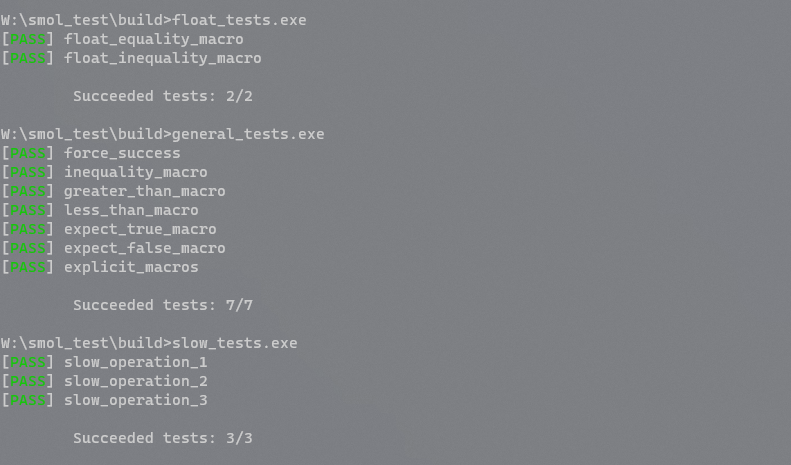
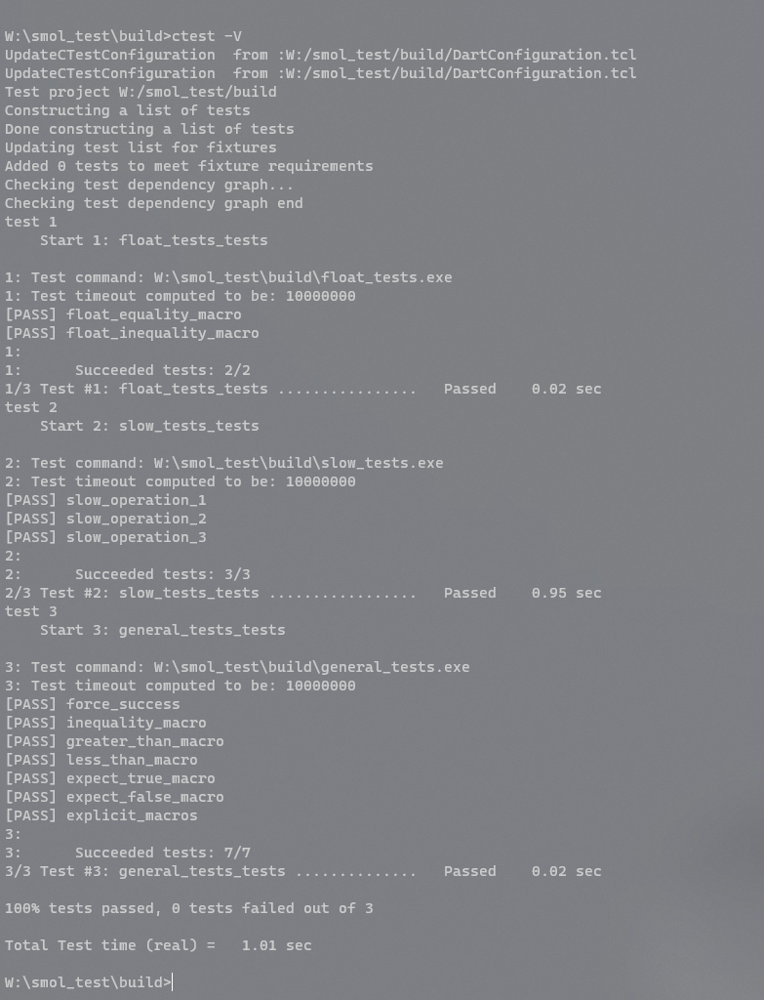

# What ?
TESTticle is a minimalist test framework I developed for testing features on my toy game engine [SMOL](https://github.com/marciovmf/smol).
It was initialy called SMOL_TEST but sounds TESTicle is undeniably more professional.

## Why
Test frameworks are usually feature rich but also bloated and unnecessarily complex, so I decided to create something tiny especially for my needs.


## How it works

Basically you compile your tests along with the test framework itself. It's composed by a .h file and a .cpp file. 

## Defining tests

Tests are just blocks of code declared within the `SMOL_TEST()` macro
```
SMOL_TEST(test_name)
{
  // your test code goes here
}
```


The following macros are available for specifying tests:

### SMOL_TEST_FAIL
Ends the test and mark it as PASS

### SMOL_TEST_SUCCESS 
Ends the test and mark it as FAIL

### SMOL_TEST_EXPECT_FLOAT_EQ(A, B)
Passes if float expressions A and B are equal. Fails otherwise.

### SMOL_TEST_EXPECT_FLOAT_NEQ(A, B)
Passes if float expressions A and B are NOT equal. Fails otherwise.

### SMOL_TEST_EXPECT_GT(A, B)
Passes if integer expression A is greater than B. Fails otherwise.

### SMOL_TEST_EXPECT_LT(A, B)
Passes if integer expression A is less than B. Fails otherwise.

### SMOL_TEST_EXPECT_TRUE( exp )
Passes if expression expr is true. Fails otherwise.

### SMOL_TEST_EXPECT_FALSE( exp )
Passes if expression expr is false. Fails otherwise.

### SMOL_TEST_WAIT_MILLISECONDS( n )
Will delay the test execution for the n milliseconds.

## Compiling tests
This CMake macro is used to create test suites, or standalone executables that
may contain multiple unit tests.

````
function(SMOL_TEST_ADD_EXECUTABLE target sourceList)
  list(APPEND sourceList smol_test.cpp smol_test.h)
  add_executable(${target} ${sourceList})
  set_property(TARGET ${target} PROPERTY CXX_STANDARD 11)
  # Include necesary include paths as needed.
  target_include_directories(${target} PRIVATE "${CMAKE_CURRENT_SOURCE_PATH}")
  # Include necessary libs as needed 
  #target_link_libraries(${target} PRIVATE smol ${OPENGL_LIBRARY})
  # Make it a CTest target
  add_test(NAME ${target}_tests COMMAND ${target})
  #Comment the next line to avoid running this test automatically
  add_custom_command(TARGET ${target} POST_BUILD COMMAND ${CMAKE_CTEST_COMMAND} ${target})
endfunction()
````

To add test suits just call the macro passing the name of the test and it's
source files. For example:

````
SMOL_TEST_ADD_EXECUTABLE(float_tests sample/float_tests.cpp)
SMOL_TEST_ADD_EXECUTABLE(slow_tests sample/slow_tests.cpp)
SMOL_TEST_ADD_EXECUTABLE(general_tests sample/general_tests.cpp)
````

## Running Tests

It's possible to run the test suites directly or via Cmake with the --target test or even invoking CTest directly in the build directory.  
Test suites tests will exit the process with exit value 0 if the all test fails or the number of failed tests otherwise.

Running the standalone test executables  


Running all the tests via Ctest  



